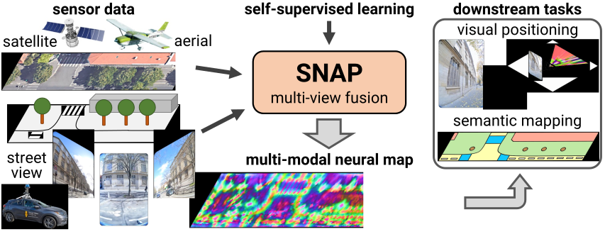

<p align="center">
  <h1 align="center">SNAP!<br><ins>S</ins>elf-Supervised <ins>N</ins>eural M<ins>ap</ins>s<br>for Visual Positioning and Semantic Understanding</h1>
  <p align="center">
    <a href="https://psarlin.com/">Paul-Edouard&nbsp;Sarlin</a>
    ·
    <a href="https://etrulls.github.io/">Eduard&nbsp;Trulls</a>
    <br>
    <a href="https://www.microsoft.com/en-us/research/people/mapoll/">Marc&nbsp;Pollefeys</a>
    ·
    <a href="https://scholar.google.com/citations?user=qsB2vcgAAAAJ&hl=en">Jan&nbsp;Hosang</a>
    ·
    <a href="https://scholar.google.com/citations?hl=en&user=RQip5VgAAAAJ">Simon&nbsp;Lynen</a>
  </p>
  <h2 align="center">
    <a href="https://arxiv.org/pdf/2306.05407.pdf" align="center">NeurIPS 2023 Paper</a>
    | <a href="https://youtu.be/xogrwdgNQdo" align="center">Video</a>
    | <a href="https://psarlin.com/doc/SNAP_NeurIPS2023_poster_compressed.pdf" align="center">Poster</a>
  </h2>
  
</p>
<p align="center">
    <a href="https://arxiv.org/pdf/2306.05407.pdf"></a>
    <br>
    <em>SNAP estimates 2D neural maps from multi-modal data like StreetView and aeral imagery.
    <br>Neural maps learn easily interpretable, high-level semantics through self-supervision alone<br>and can be used for geometric and semantic tasks.</em>
</p>

##

This repository hosts the training and inference code for SNAP, a deep neural network that turns multi-modal imagery into rich 2D neural maps.
SNAP was trained on a large dataset of 50M StreetView images with associated camera poses and aerial views.
**We do not release this dataset and the trained models, so this code is provided solely as a reference and cannot be used as is to reproduce any result of the paper.**

## Usage

The project requires Python >= 3.10 and is based on [Jax](https://github.com/google/jax) and [Scenic](https://github.com/google-research/scenic). All dependencies are listed in [`requirements.txt`](./requirements.txt). 

- The data is stored as TensorFlow dataset and loaded in `snap/data/loader.py`.
- Train SNAP with self-supervision:
```bash
python -m snap.train --config=snap/configs/train_localization.py \
    --config.batch_size=32 \
    --workdir=train_snap_sv+aerial
```
- Evaluate SNAP for visual positioning:
```bash
python -m snap.evaluate --config=snap/configs/eval_localization.py \
    --config.workdir=train_snap_sv+aerial \
    --workdir=.  # unused
```
- Fine-tune SNAP for semantic mapping:
```bash
python -m snap.train --config=snap/configs/train_semantics.py \
    --config.batch_size=32 \
    --config.model.bev_mapper.pretrained_path=train_snap_sv+aerial \
    --workdir=train_snap_sv+aerial_semantics
```
- Evaluate the semantic mapping:
```bash
python -m snap.evaluate --config=snap/configs/eval_semantics.py \
    --config.workdir=train_snap_sv+aerial_semantics \
    --workdir=.  # unused
```

## BibTeX citation
If you use any ideas from the paper or code from this repo, please consider citing:

```bibtex
@inproceedings{sarlin2023snap,
  author    = {Paul-Edouard Sarlin and
               Eduard Trulls and
               Marc Pollefeys and
               Jan Hosang and
               Simon Lynen},
  title     = {{SNAP: Self-Supervised Neural Maps for Visual Positioning and Semantic Understanding}},
  booktitle = {NeurIPS},
  year      = {2023}
}
```

*This is not an officially supported Google product.*
